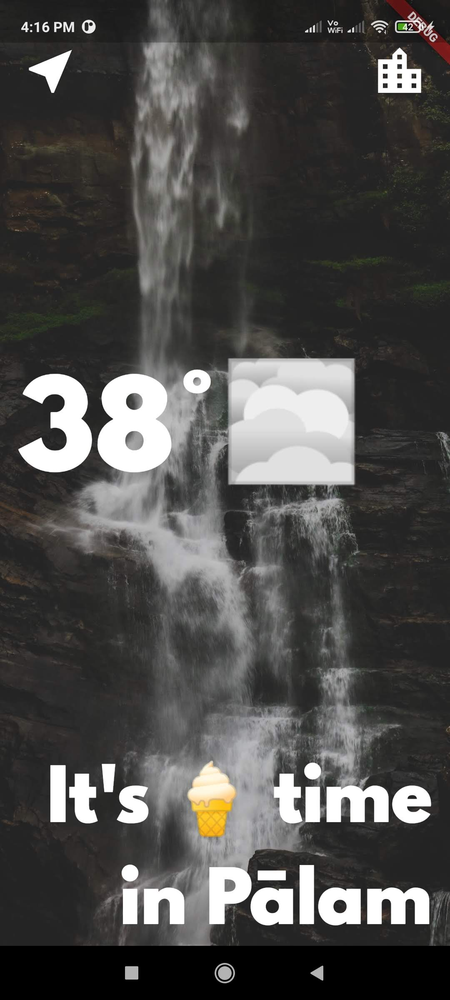
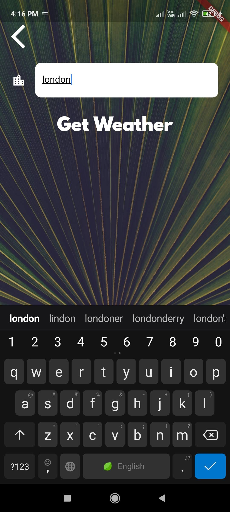

# Weather App

## It is an Android and iOS Mobile App that gives live weather data using weather API.

### Technology Used:

1. Flutter
2. Dart

### Packages Used:

1. cupertino_icons
2. geolocator
3. http
4. flutter_spinkit

## App UI ScreenShots

### Main Page UI:

  

### Search Bar UI:

### Result Page UI:

 

## Video Demos

### Demo 1:

https://user-images.githubusercontent.com/50834301/126122130-54a6d3fc-5ead-4985-8503-bea4b8fa2fb7.mp4

## Demo 2:

https://user-images.githubusercontent.com/50834301/126122297-af698ab7-b48b-4a67-80e9-927122b1473e.mp4
